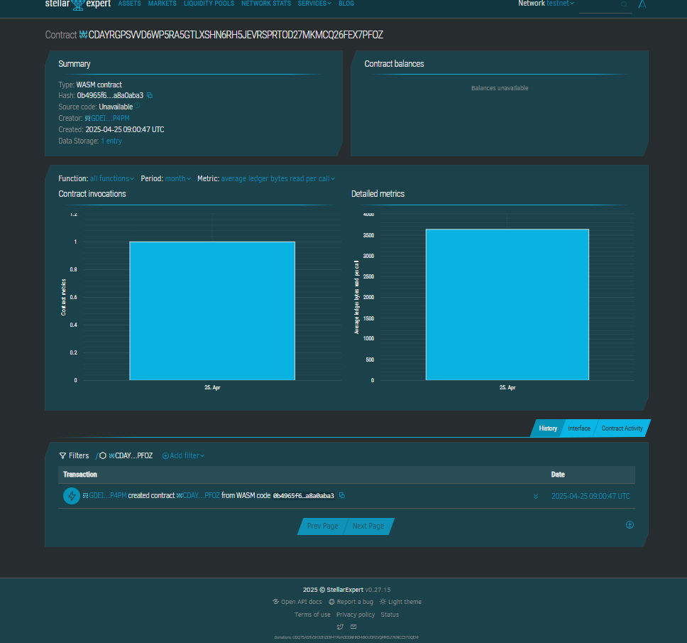

# Crowd-Funded Project Platform

## 📌 Project Description
The **Crowd-Funded Project Platform** is a decentralized application (dApp) powered by a Soroban-based smart contract. It allows users to create funding campaigns and receive contributions directly on-chain in a secure and transparent way.

## 🌟 Project Vision
The vision is to **empower creators and innovators** by providing them with a trustless platform to raise funds globally, removing the need for intermediaries and reducing operational overhead.

## 🚀 Key Features
- **Create Campaigns:** Anyone can launch a new project with a funding goal and description.
- **Fund Projects:** Contributors can fund any project by sending an amount they choose.
- **Track Progress:** View project funding status in real time.
- **Automatic Completion:** When the goal is reached, the project is marked as fully funded.

## 🔭 Future Scope
- Implement project withdrawal mechanisms for the owner once goals are reached.
- Add refund logic for unsuccessful projects.
- Integrate milestone-based disbursements.
- Enable voting/governance features for backers.
- Create a front-end interface for public interaction.

## Contract details
CDAYRGPSVVD6WP5RA5GTLXSHN6RH5JEVRSPRTOD27MKMCQ26FEX7PFOZ

